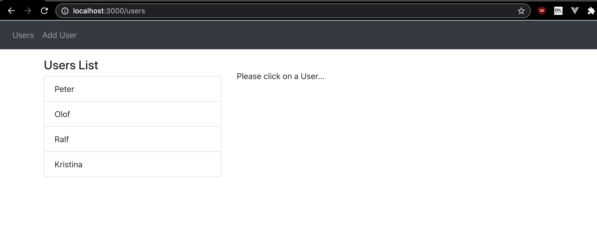
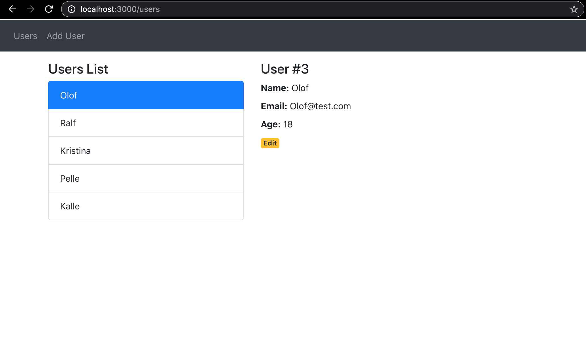
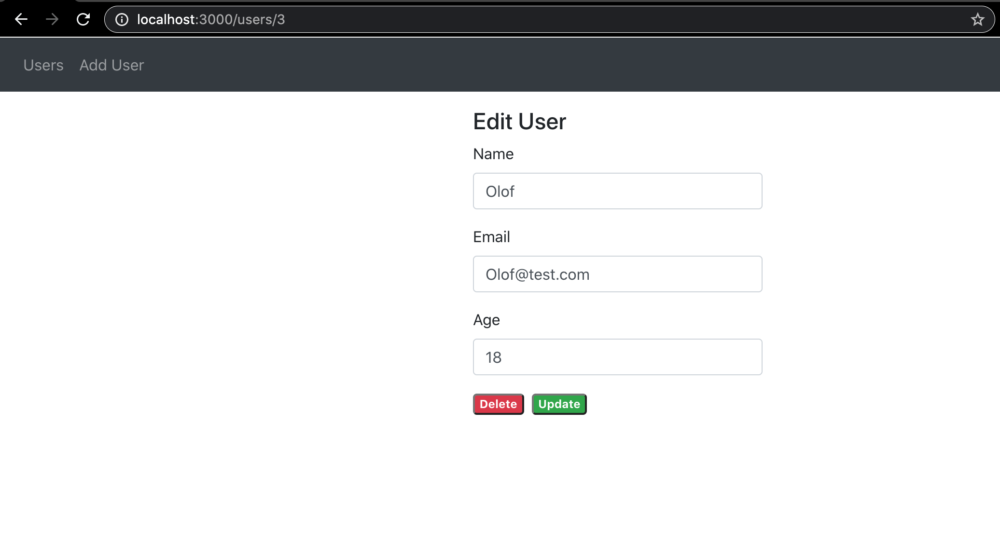
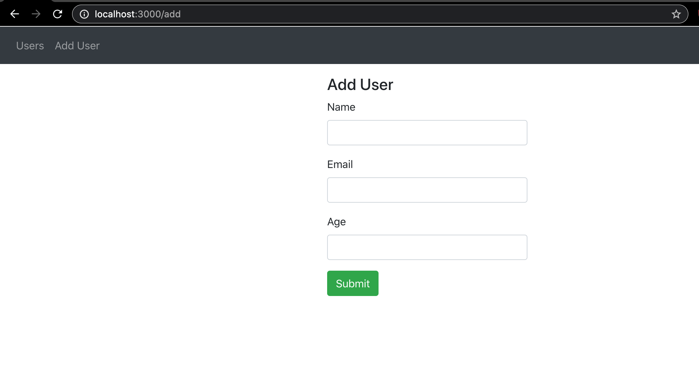
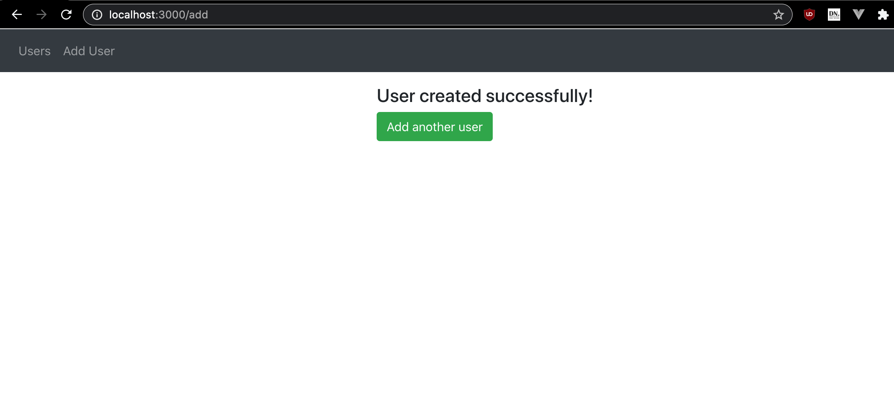
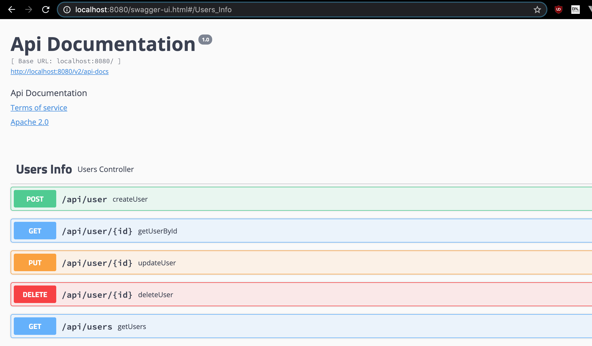

# UsersApp
A simple java Springboot backend with CRUD endpoints to store and handle users. With a react frontend to consume the endpoints.

To run it,
1. Run 'yarn start' in /react/app/
2. Start the java backend either via running it in IntelliJ, or run it as a .jar file

React frontend is available at localhost:3000
Java backend is available at localhost:8080 - To to swagger-ui to see endpoints: localhost:8080/swagger-ui.html

1. Main screen, displays all currently stored users

2. Selecting a user displays further info about the user, and gives the option to edit the user

3. Inside the edit screen of the user, you can update the fields. Or delete the user.

4. Inside the Add new User screen, you can add a new user

5. Screen once you have successfully added a new user

6. Screenshot of the user interface of the backend endpoints

